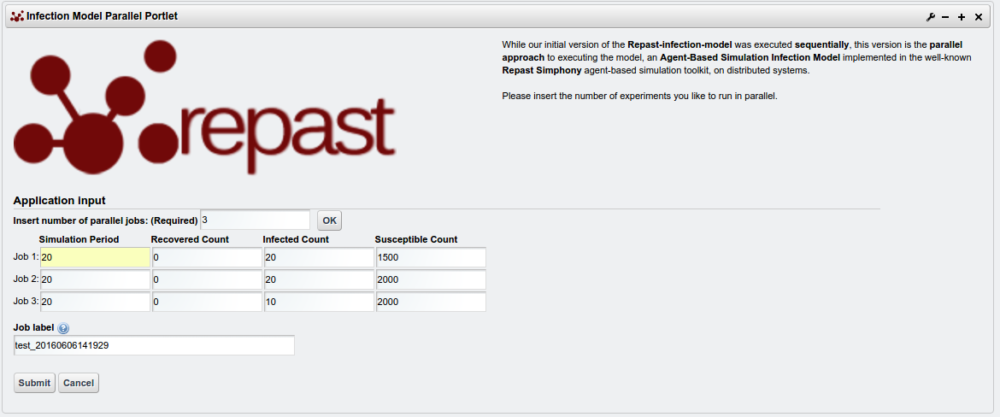
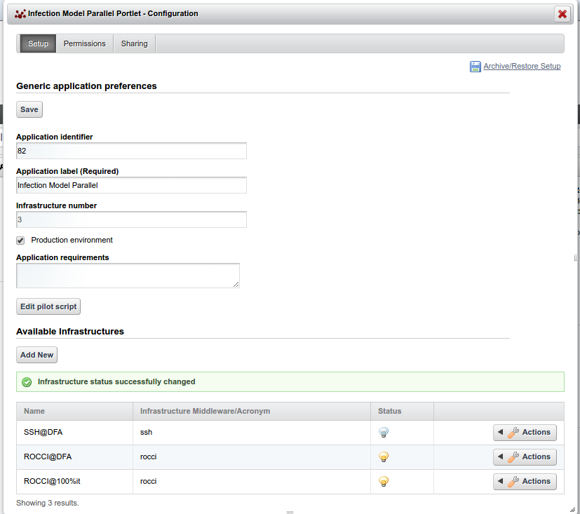

*********************************
INFECTION MODEL PARALLEL PORTLET
*********************************

============
About
============
.. images/ABINIT_logo.png

While the first version of the Infection Model portlet was executed sequentially, this version, the Infection Model parallel portlet, would be executed in parallel. This porlet will be used to investigate how an Agent Based modelling simulation experiments can be executed in parallel by making use of high performance computing facilities.

Similar to the Infection model portlet, it makes use of different input parameters to help users submit expereiments and obtain results. These parameters include: input parameters for the model include the simulation period (specifies how many years the simulation will run), recovered count (specifies the initial healthy population), infected count (specifies the initial infected population) and susceptible count (specifies the initial susceptible population). When an infected agent approaches a susceptible agent, it becomes infected and if there are more than one susceptible agent in the cell, only one, randomly selected agent, is infected. Infected agents recover after a period and become healthy with a level of immunity. Recovered agents immunity decreases every time they are approached by an infected agent and when immunity becomes zero, the recovered agent becomes susceptible and can be infected again, thereby, forming a host of infection networks.

However, rather than running jobs sequentially, with single core machines, this version will run jobs with machines that have many cores running at different cloud sites.

============
Installation
============

This section explains how to deploy and configure the infectionModel-parallel-portlet
into a Science gateway to submit some preconfigures experitments towards
Distributed Computing infrastructures.

1. Move into your Liferay plugin SDK portlets folder and clone the
infectionModel-portlet source through the following git command:

.. code:: bash

        git clone https://github.com/csgf/infectionModel-parallel-portlet.git

2. Now, move into the just created infectionModel-parallel-portlet directory and execute
the deploy command:

.. code:: bash

        ant deploy

When the previous command has completed, verify that the portlet is
*"Successfully autodeployed"*, look for a string like this in the Liferay log
file under $LIFERAY_HOME/glassfish-3.1.2/domains/domain1/logs/server.log.

3. Then, open your browser and point at your Science Gateway instance and form
there click Add > More in the Brunel University category, click on Add button to
add this new portlet. Following picture shows the correctly result:

As soon as the portlet has been successfully deployed you have to configure:

1. the list of e-Infrastructures where the application can be executed;
2. some additional application settings.

To configure the e-Infrastructure, go to the portlet preferences and provide the
the right values for the following parameters:

- **Enable infrastructure**: A yes/no flag which enables or disable the generic e-Infrastructure;
- **Infrastructure name**: A label representing the e-Infrastructure;
- **Infrastructure acronym**: The acronym to reference the e-Infrastructure;
- **BDII**: The Top BDII for this e-Infrastructure;
- **WMS Hosts**: A separated `;` list of WMS endpoint for this e-Infrastructure;
- **Proxy Robot host server**: The eTokenServer for this e-Infrastructure;
- **Proxy Robot host port**: The eTokenServer port for this e-Infrastructure;
- **Proxy Robot secure connection**: A true/false flag if the eTokenServer require a secure connection;
- **Proxy Robot Identifier**: The MD5SUM of the robot certificate to be used for this e-Infrastructure;
- **Proxy Robot Virtual Organization**: The VO for this e-Infrastructure;
- **Proxy Robot VO Role**: The VO role for this e-Infrastructure;
- **Proxy Robot Renewal Flag**: A true/false Flag to require proxy renewal before it expires;
- **Local Proxy**: The path to the proxy if you are using a local proxy;
- **Software Tags**: The list of software tags requested by the application.

The following figure shown how the portlet has been configured to run simulation
on a cloud based system.

Another important step to have infectionModel-portlet ready to be used is: to
create a new entry in GridOperations table of the UsersTracking database, as
shown below.

.. code:: sql

    INSERT INTO GridOperation VALUES ('<portal name>' ,'Infection Model portlet');

    -- portal name: is a label representing the portal name, you can get the
    -- right value from your Science Gateway istance.

============
Usage
============

Similar to the infection Model portlet, When an authorised user successfully log on, they are presented with the portlet, i.e the infection model-parallel portlet. However, this portlet only present an interface where users can specify the number of expereiments they will like to execute in parallel. This is done by inserting the number of jobs in the "insert number of parallel jobs" field. After specifying the number of jobs, users can then click on the ok button and this will automatically generate and display the input fields for the different parameters of the infection model (i.e the recovered, susceptible and the infected population). Users can then specify their input parameters by using these fields. After a user has finished specifying the parameters and clicked on the submit button, the jobs can then be submitted to the different Distributed Computing Infrastructures. After submitting a job, users would be notified that their jobs have been successfully submitted and then advised to check the MyJobs portlet, a dedicated portlet where the status of all running jobs can be found. A job will be considered to be done when all the running jobs, which have been submitted in parallel, becomes done. A done job status would be represented by a small folder icon and users can download the output of the infection model for analysis.

==============
Contributor(s)
==============

If you have any questions or comments, please feel free to contact us using the
Sci-GaIA project dicussion forum (`discourse.sci-gaia.eu <discourse.sci-gaia.eu>`_)

.. _BRUNEL: http://www.brunel.ac.uk/
.. _DFA: http://www.dfa.unict.it/

:Authors:
 Roberto BARBERA - University of Catania (DFA_),

 Adedeji FABIYI  - Brunel University London (BRUNEL_),

 Simon TAYLOR    - Brunel University London (BRUNEL_),

 Mario TORRISI   - University of Catania (DFA_)
