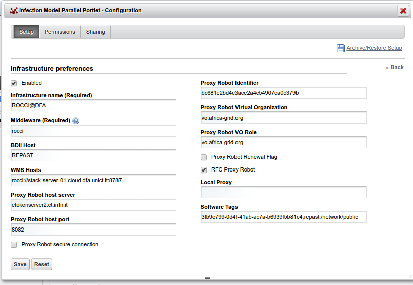

*********************************
INFECTION MODEL PARALLEL PORTLET
*********************************

============
About
============
.. images/ABINIT_logo.png

.. image:: images/Repast_logo_100h.png
   :height: 100px
   :align: left
   :target: https://github.com/csgf/infectionModel-portlet
   :alt: infectionModel-portlet logo

While the first version of the Infection Model portlet was executed sequentially, this version, the Infection Model parallel portlet, would be executed in parallel. This porlet will be used to investigate how an Agent Based modelling simulation experiments can be executed in parallel by making use of high performance computing facilities.

Similar to the Infection model portlet, it makes use of different input parameters to help users submit expereiments and obtain results. These parameters include: input parameters for the model include the simulation period (specifies how many years the simulation will run), recovered count (specifies the initial healthy population), infected count (specifies the initial infected population) and susceptible count (specifies the initial susceptible population). When an infected agent approaches a susceptible agent, it becomes infected and if there are more than one susceptible agent in the cell, only one, randomly selected agent, is infected. Infected agents recover after a period and become healthy with a level of immunity. Recovered agents immunity decreases every time they are approached by an infected agent and when immunity becomes zero, the recovered agent becomes susceptible and can be infected again, thereby, forming a host of infection networks.

However, rather than running jobs sequentially, with single core machines, this version will run jobs with machines that have many cores running at different cloud sites.

============
Installation
============

This section explains how to deploy and configure the **infectionModel-parallel-portlet**.

1. Move into your Liferay plugin SDK portlets folder and clone the template-portlet
source code through the git clone command:

.. code:: bash

        git clone https://github.com/csgf/infectionModel-parallel.git

2. Now, move into the just created portlet directory and execute the deploy
command:

.. code:: bash

        ant deploy

When the previous command has completed, verify that the portlet was *"Successfully
autodeployed"*, look for a string like this in the Liferay log
file under ``$LIFERAY_HOME/glassfish-3.1.2/domains/domain1/logs/server.log``.

3. Then, open your browser and point at your Science Gateway instance and form
there click Add > More in the ``BRUNEL`` category, click on Add button to
add this new portlet. Following picture shows the correctly result:

.. image:: images/view.png
    :align: center
    :width: 90%
    :alt: infectionModel-parallel view

As soon as the portlet has been successfully deployed you have to configure it using
the portlet configuration menu. Portlet configuration is splitted in two parts:
*Generic application preferences*, *Infrastructures preferences*.

Generic application preferences
~~~~~~~~~~~~~~~~~~~~~~~~~~~~~~~

The generic part contains:

* **Application Identifier** the identifier assigned to tha application in the GridInteractions database table.
* **Application label** *(Required)* a short meaningful label for the application.
* **Production environment** a boolean flag that specify if the portlet will be used in a production or development environment.

  * if *true* the development environment preferences will be shown
      * **UserTrackingDB hostname** hostname of the Grid and Cloud Engine Usertracking database. Usually *localhost*
      * **UserTrackingDB username** username of the Grid and Cloud Engine Usertracking database user. Usually *user_tracking*
      * **UserTrackingDB password** password specified for the Usertracking database user. Usually *usertracking*
      * **UserTrackingDB database** Grid and Cloud Engine Usertracking database name. Usually *userstracking*

* **Application requirements** the necessary statements to specify a job execution requirement, such as a particular software, a particular number of CPUs/RAM, etc. defined using JDL format.

.. image:: images/portlet_pref.png
   :align: center
   :width: 90%
   :alt: infectionModel-parallel preference

.. note:: You can get the *Application Idetifier* inserting a new entry into the **GridOperations** table:

    .. code:: sql

        INSERT INTO GridOperation VALUES ('<portal name>' ,'Template Portlet');
          -- portal name: is a label representing the portal name, you can get the
          -- right value from your Science Gateway istance.

Infrastructure preferences
~~~~~~~~~~~~~~~~~~~~~~~~~~~~~~~

The infrastructure preferences section shows the e-Infrastructures configured.
Using the actions menu on the right side of the table, you can:

* Activate / Deactivate
* Edit
* Delete

an available infrastructure.
The *Add New* button is meant to add a new infrastructure available to the application.
When you click this button a new panel, will be shown with several fields where
you can specify the Infrastructure details.

The fields belonging to this panel are:

* **Enabled** A boolean which enable or disable the current infrastructure.
* **Infrastructure Name** *(Required)* The infrastructure name for these settings.
* **Middleware** *(Required)* The middleware used by the current infrastructure. Here you can specify 3 different values.

  * **an acronym** for gLite based middleware.
  * **ssh** for HPC Cluster.
  * **rocci** for cloud based middleware.

Following fields will be traslated in the relevant infrastructure parameters based on the value specified in this field.

* **BDII host**: The Infrastructure information system endpoint (URL).

  * If Middleware is **ssh** here you can specify a ";" separated string with ssh authentications parameters (username;password or username for key based authentication).
  * If Middleware is **rocci** here you can specify the name of the compute resource that will be created.

* **WMS host**: is the service endpoint (URL).
* **Robot Proxy host server**: the robot proxy server hostname.
* **Robot Proxy host port**: the robot proxy server port.
* **Proxy Robot secure connection**: a boolean to specify if robot proxy server needed a SSL connection.
* **Robot Proxy identifier**: the robot proxy identifier.
* **Proxy Robot Virtual Organization**: the virtual organization configured.
* **Proxy Robot VO Role**: the role virtual organization configured.
* **Proxy Robot Renewal Flag**: a boolean to specify if robot proxy can be renewed before its expiration.
* **RFC Proxy Robot**: a boolean to specify if robot proxy must be RFC.

  * If Middleware is **rocci** this field must be checked.

* **Local Proxy**: the path of a local proxy if you want use this type of authentication.
* **Software Tags**: infrastructure specific information.

  * If Middleware is **rocci** here you can specify a ";" separated string with ``<image_id>;<flavor>;<link_resource>``

============
Usage
============

Similar to the infection Model portlet, When an authorised user successfully log on, they are presented with the portlet, i.e the infection model-parallel portlet. However, this portlet only present an interface where users can specify the number of expereiments they will like to execute in parallel. This is done by inserting the number of jobs in the "insert number of parallel jobs" field. After specifying the number of jobs, users can then click on the ok button and this will automatically generate and display the input fields for the different parameters of the infection model (i.e the recovered, susceptible and the infected population). Users can then specify their input parameters by using these fields. After a user has finished specifying the parameters and clicked on the submit button, the jobs can then be submitted to the different Distributed Computing Infrastructures. After submitting a job, users would be notified that their jobs have been successfully submitted and then advised to check the MyJobs portlet, a dedicated portlet where the status of all running jobs can be found. A job will be considered to be done when all the running jobs, which have been submitted in parallel, becomes done. A done job status would be represented by a small folder icon and users can download the output of the infection model for analysis.

==============
Contributor(s)
==============

If you have any questions or comments, please feel free to contact us using the
Sci-GaIA project dicussion forum (`discourse.sci-gaia.eu <discourse.sci-gaia.eu>`_)

.. _BRUNEL: http://www.brunel.ac.uk/
.. _DFA: http://www.dfa.unict.it/

:Authors:
 Roberto BARBERA - University of Catania (DFA_),

 Adedeji FABIYI  - Brunel University London (BRUNEL_),

 Simon TAYLOR    - Brunel University London (BRUNEL_),

 Mario TORRISI   - University of Catania (DFA_)
